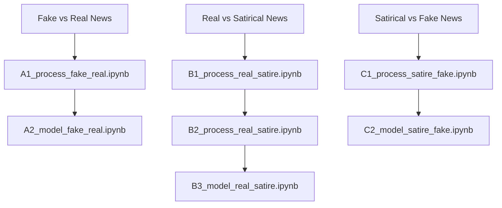

<!-- PROJECT LOGO -->
<br />
<div align="center">
  <a href="https://github.com/alisongh/SIADS-699-Onion/blob/christine-readme-updates">
    
  </a>
</div>

<h3 align="center">When fact is false and false is funny:</h3>
<h3 align="center">Automated detection of fake and satirical news</h3>

<h4 align="center">Christine Gregg, Liwen Huang, & Ali Tobah</h4>
<h4 align="center">University of Michigan, Ann Arbor | SIADS 699</h4>
<br>

<!-- ABOUT THE PROJECT -->
## About The Project

False information comes in different forms, and for many reasons. In the study of social media, Big Data, and the Internet, three names for false information are common: misinformation, disinformation and fake news. In this study, we use ‘fake news,’ because we focus on false information in news articles without regard for intent.

For our purposes, we are considering a simplified concept of the “universe of news” where there are only three categories: real news, fake news, and satirical news. Our focus is on identifying the features that have the greatest impact on differentiating these types of news with the hope of making the distinction between them more clear for everyday news readers.


<!-- GETTING STARTED -->
## Getting Started

### Installation

1. Clone the repo
   ```sh
   git clone https://github.com/alisongh/SIADS-699-Onion.git
   ```
2. Install necessary packages
   ```sh
   pip install -r requirements.txt
   ```


<!-- USAGE EXAMPLES -->
## Usage & Notebook Dependencies

Three models were created during the course of this project:
- Fake vs Real News
- Real vs Satire News
- Satire vs Fake News

Although all necessary raw data has been included in this repo, some of the processed data was truncated due to GitHub file size limits. If you would like to run a model or any of the associated visualizations using the <i>full</i> dataset, you can either 1) generate the processed files using the relevant processing notebooks or 2) download the processed files from our [Google Drive](https://drive.google.com/drive/folders/154R-CysENplo0ZkQAUC_uxB2BUod5QFN?usp=sharing). Our notebooks are also available in the Google Drive where they can be mounted to the drive and run with Google Colab.



<!-- DATA ACCESS -->
## Data Access

All data used throughout this project is open source and available from their respective sources:
- Fake vs Real
  - Paper: https://doi.org/10.48550/ARXIV.1708.07104
  - Dataset: https://www.kaggle.com/datasets/sumanthvrao/fakenewsdataset
- Real vs Satire
  - Paper: https://aclanthology.org/D17-1211/
  - Dataset: https://data.mendeley.com/v1/datasets/hx3rzw5dwt/draft
- Satire vs Fake
  - Paper: https://dl.acm.org/doi/10.1145/3201064.3201100
  - Dataset: https://github.com/jgolbeck/fakenews
