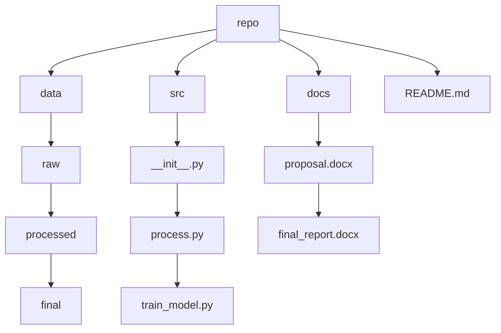
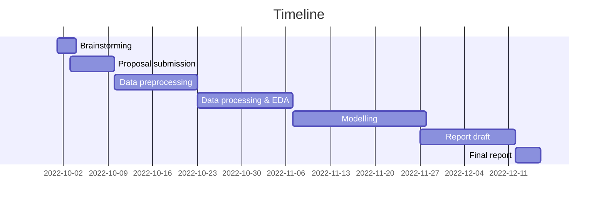

# Team Onion
## SIADS 699 Capstone, University of Michigan, Ann Arbor
### Subject: Identifying accurate news vs fake news/misinformation vs satirical news

Team members: Christine Gregg, Liwen Alison Huang, Ali Tobah 

#### Questions
* Can a model be trained to differentiate fake news from real news based on the language and topic of the article?
* If a model does well at differentiating between real and fake news, does it also perform well at differentiating between fake news and satire?

#### GitHub repo

#### Timeline

